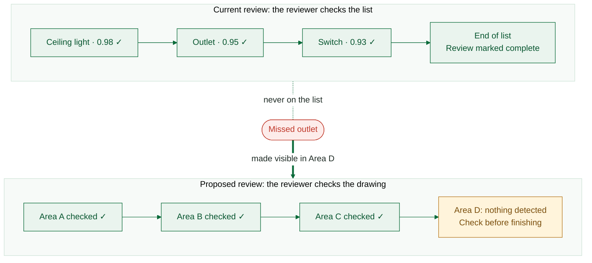
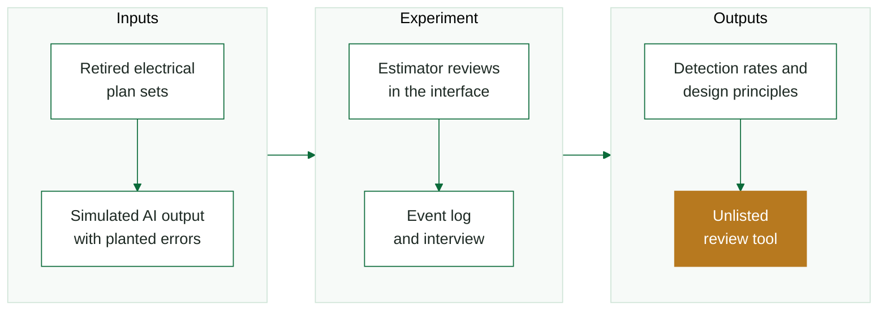
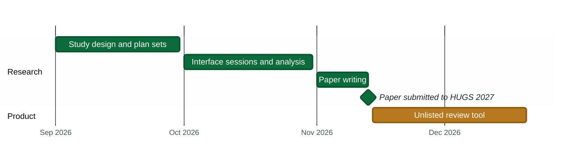

<h1 align="center">Unlisted</h1>

<p align="center"><b>Find what the AI didn't list.</b></p>

<p align="center">
A research project and review tool on how AI takeoff tools hide missing items from electrical estimators.
</p>

<p align="center">
  
  
  
</p>

<p align="center">
  <a href="#the-problem">The problem</a> &nbsp;•&nbsp;
  <a href="#research-questions">Research questions</a> &nbsp;•&nbsp;
  <a href="#how-it-works">How it works</a> &nbsp;•&nbsp;
  <a href="#roadmap">Roadmap</a> &nbsp;•&nbsp;
  <a href="#about">About</a>
</p>

<br>

## The problem

AI tools now read construction drawings, detect items such as outlets and light fixtures, and turn them into a bid. Before signing, the estimator reviews the output on a **ranked list of what the AI detected**.

An item the AI missed never appears on that list. There is nothing to click, nothing to reject, and no sign that anything is absent. The estimator reaches the end of the list and believes the whole drawing has been checked.

> [!IMPORTANT]
> **The interface asks the estimator to review a list. The estimator believes they reviewed the document.**
> The gap between the two contains only the errors nobody can see. We call this pattern **Verification Scoping**.



## Research questions

| | Question |
|:--|:--|
| **RQ1** | Does the direction of an AI counting error determine whether an estimator catches it? |
| **RQ2** | How should the review interface be designed so that finishing the list does not feel like finishing the document? |
| **H1** | A missing item is corrected less often than an added item with the same cost impact. |

## How it works



<table>
<tr>
<td width="33%" valign="top">

**1. Study**

Professional estimators review simulated AI output on retired electrical plan sets. Missing and added items are matched on cost impact, and every action is logged.

</td>
<td width="33%" valign="top">

**2. Paper**

The findings and design principles are written up for the HUGS 2027 workshop at ICSE.

</td>
<td width="33%" valign="top">

**3. Product**

Unlisted tracks which areas of the drawing have been checked and flags areas where nothing was detected.

</td>
</tr>
</table>

## Roadmap



| Milestone | Date | Status |
|:--|:--|:--:|
| Study design, literature review, plan sets | September 2026 | 🟢 In progress |
| Review interface, study sessions, analysis | October 2026 | ⚪ Planned |
| Paper submitted to HUGS 2027 | 13 November 2026 | ⚪ Planned |
| Unlisted review tool built and tested | December 2026 | ⚪ Planned |

## Repository

```text
.
├── docs/              proposal and poster
├── review-interface/  web app used in the study        (planned)
├── analysis/          scoring and analysis scripts     (planned)
└── improved-tool/     the Unlisted review tool         (planned)
```

> [!NOTE]
> Study materials and participant data are not published, to protect the study design and participant privacy.

## Built with


## Key references

1. C. M. Gray, C. T. Santos, N. Bielova and T. Mildner, "An Ontology of Dark Patterns Knowledge," *CHI*, 2024.
2. R. Parasuraman and D. H. Manzey, "Complacency and Bias in Human Use of Automation," *Human Factors*, 2010.
3. L. J. Skitka, K. L. Mosier and M. Burdick, "Does Automation Bias Decision Making?" *International Journal of Human-Computer Studies*, 1999.
4. Hamppi, "Integrating AI into Procurement Processes in Construction," MSc thesis, Aalto University, 2025.

## About

Capstone project, B.S. in Computer Science, School of Science and Engineering, **Al Akhawayn University**.

**Mehdi [Last name]**, supervised by **Dr. Hoda Khalafalla**

[your university email] • [LinkedIn](https://www.linkedin.com/in/your-profile)
